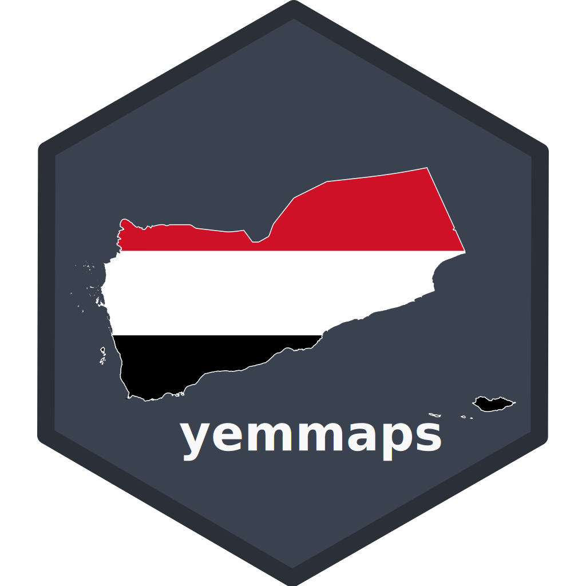

```{r, include = FALSE}
knitr::opts_chunk$set(
  collapse = TRUE,
  comment = "#>",
  fig.path = "man/figures/README-",
  out.width = "100%"
)
```

# yemmaps 

<!-- badges: start -->
[](https://lifecycle.r-lib.org/articles/stages.html#experimental)
<!-- badges: end -->

yemmaps is an R package for accessing and working with geographic boundary data for Yemen.
It provides easy-to-use functions to retrieve boundaries at different administrative levels—country,
regions, provinces, and districts—and integrates smoothly with tools like ggplot2,
leaflet, and sf for visualization. You can also join your own data,
like population or economic info, to these boundaries for mapping and analysis.

## Installation

You can install the development version of yemmaps like so:

``` r

```

## Example

This is a basic example which shows you how to solve a common problem:

```{r setup, include=FALSE}
knitr::opts_chunk$set(
  fig.width = 9,
  fig.asp = 0.5625,
  fig.dpi = 300,
  out.width = "100%"
)
```

```{r adm0_example, fig.width}
library(yemmaps)
yem_plot_adm0()
```

```{r adm1_example, fig.width=9, fig.asp = 0.5625}
library(yemmaps)
yem_plot_adm1()
```
