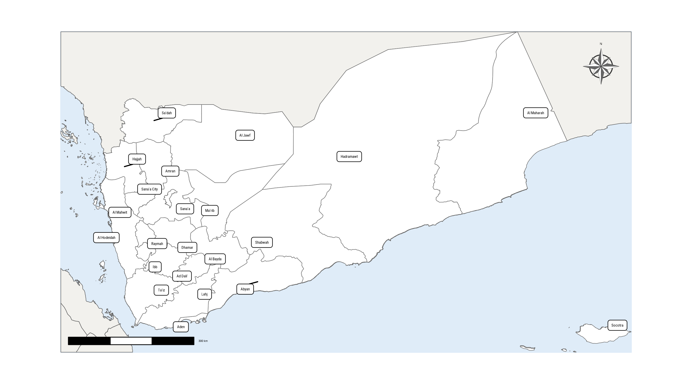

# yemmaps 

<!-- badges: start -->

[](https://lifecycle.r-lib.org/articles/stages.html#experimental)
<!-- badges: end -->

yemmaps is an R package for accessing and working with geographic
boundary data for Yemen. It provides easy-to-use functions to retrieve
boundaries at different administrative levels—country, regions,
provinces, and districts—and integrates smoothly with tools like
ggplot2, leaflet, and sf for visualization. You can also join your own
data, like population or economic info, to these boundaries for mapping
and analysis.

## Installation

You can install the development version of yemmaps like so:

``` r
```

## Example

This is a basic example which shows you how to solve a common problem:

``` r
library(yemmaps)
library(ggplot2)
library(hrbrthemes)

theme_set(theme_ipsum())

ggplot(yemmap_adm0) +
  geom_sf() +
  labs(title = "Administrative map of Yemen")
```


``` r
library(yemmaps)
library(ggplot2)
library(hrbrthemes)
library(ggrepel)

theme_set(theme_ipsum())

ggplot(yemmap_adm1) +
  geom_sf(fill = "white") +
  ggrepel::geom_label_repel(
    aes(label = ADM1_EN, geometry = geometry),
    stat = "sf_coordinates",
    size = 8 / .pt
  ) +
  labs(
    title = "Administrative map of Yemen",
    subtitle = "at the level of governorate"
  )
#> Warning in st_point_on_surface.sfc(sf::st_zm(x)): st_point_on_surface may not
#> give correct results for longitude/latitude data
```


